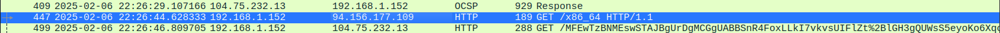
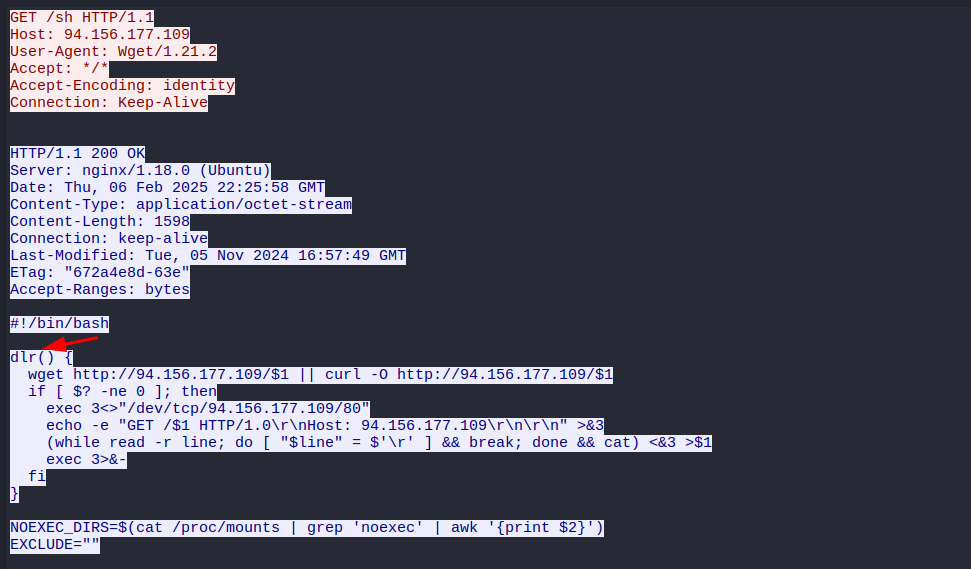
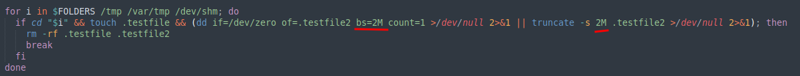
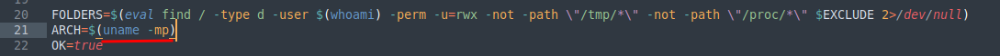
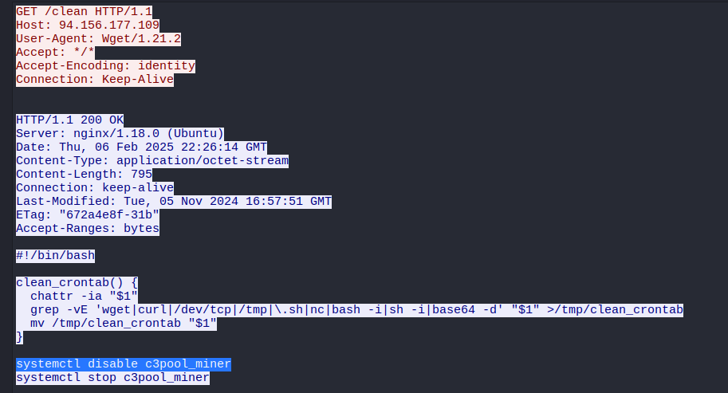
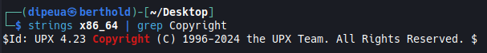
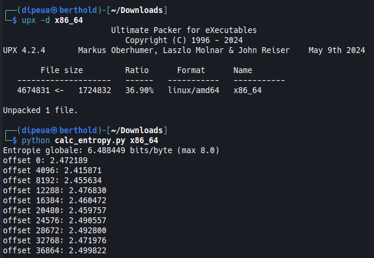

# Cuidado


What is the victim's IP address?

```
192.168.1.152
```

What is the IP address of the attacker from whom the files were downloaded?

```
94.156.177.109
```



Which malicious file appears to be the first one downloaded?

> Apply HTTP filtering and monitor the flow

```
sh
```

What is the name of the function that the attacker used to download the payload?

```
dlr
```



Which port does the attacker's server use?

```
80
```

The script checks which directories it can write to by attempting to create test files. What is the size of the second test file? (Size in MB)

```
2
```



What is the full command that the script uses to identify the CPU architecture?

```
uname -mp
```


What is the name of the file that is downloaded after the CPU architecture is compared with reference values?

```
x86_64
```

What is the full command that the attacker used to disable any existing mining service?

```
systemctl disable c3pool_miner
```



Apparently, the attacker used a packer to compress the malware. Which version of this packer was used? (Format X.XX)

```
4.23
```



What is the entropy value of unpacked malware?

Code to know the entropy

```python
import math
from collections import Counter

def entropy_from_counts(counts, total):
    H = 0.0
    for c in counts.values():
        p = c / total
        if p > 0:
            H -= p * math.log2(p)
    return H  # bits per symbol (bits per byte)

def file_entropy(path, blocksize=65536):
    # calcule l'entropie sur tout le fichier
    counts = Counter()
    total = 0
    with open(path, "rb") as f:
        while True:
            b = f.read(blocksize)
            if not b:
                break
            counts.update(b)
            total += len(b)
    return entropy_from_counts(counts, total)

def sliding_entropy(path, window_size=8192, step=4096):
    # renvoie [(offset, entropy), ...] en parcourant le fichier
    results = []
    with open(path, "rb") as f:
        data = f.read()  # pour fichiers raisonnables; sinon utiliser buffer circulaire
    n = len(data)
    for start in range(0, max(1, n - window_size + 1), step):
        window = data[start:start+window_size]
        counts = Counter(window)
        H = entropy_from_counts(counts, len(window))
        results.append((start, H))
    return results

if __name__ == "__main__":
    import sys
    if len(sys.argv) < 2:
        print("Usage: python calc_entropy.py <file>")
        sys.exit(1)

    path = sys.argv[1]
    H = file_entropy(path)
    print(f"Entropie globale: {H:.6f} bits/byte (max 8.0)")

    # afficher quelques fenêtres
    se = sliding_entropy(path, window_size=8192, step=4096)
    for off, h in se[:10]:
        print(f"offset {off}: {h:.6f}")
```

```
6.488449
```



What is the file name with which the unpacked malware was submitted on VirusTotal for the first time?

```
redtail.cuidado
```

What MITRE ATT&CK technique ID is associated with the main purpose of the malware?

```
T1496
```

