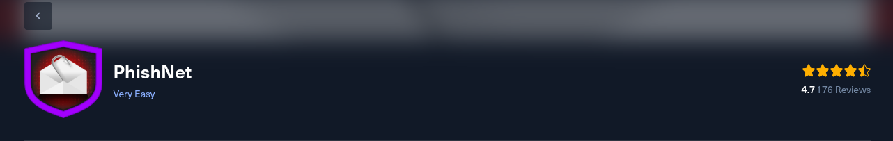
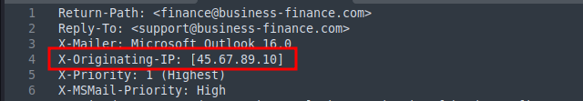
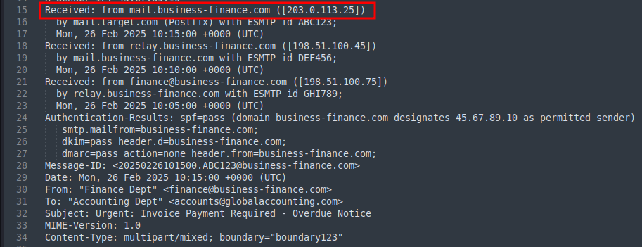
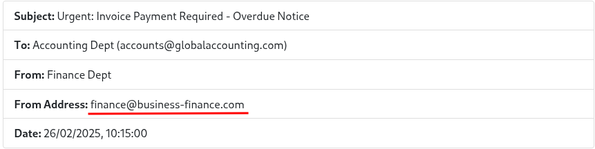
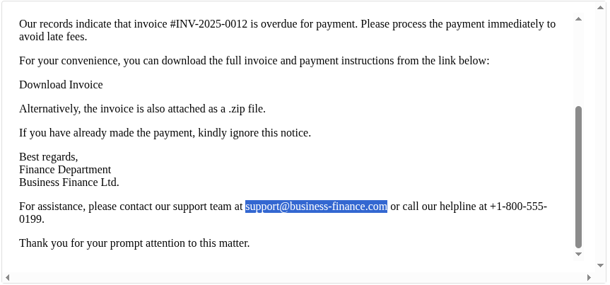
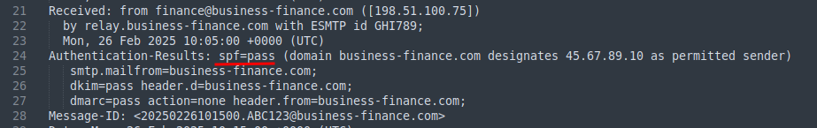
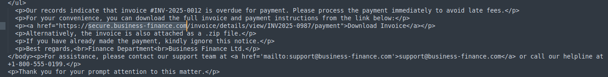
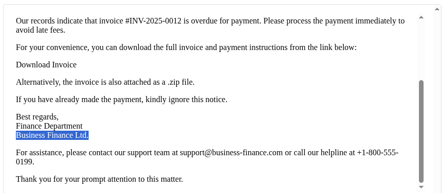
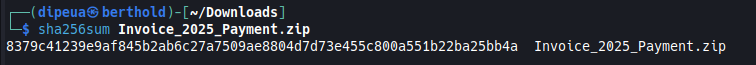
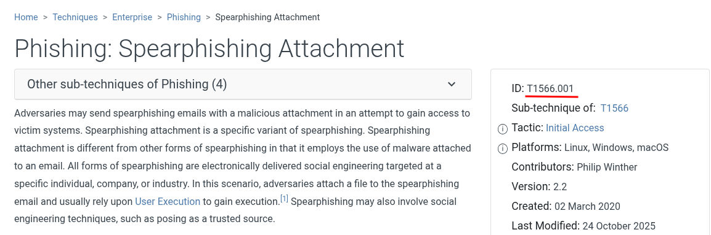

# PhishNet



What is the originating IP address of the sender?

```
45.67.89.10
```


Which mail server relayed this email before reaching the victim?


```
203.0.113.25
```


What is the sender's email address?

```
finance@business-finance.com
```



What is the 'Reply-To' email address specified in the email?

```
support@business-finance.com
```



What is the SPF (Sender Policy Framework) result for this email?

```
pass
```


What is the domain used in the phishing URL inside the email?

```
secure.business-finance.com
```



What is the fake company name used in the email?

```
Business Finance Ltd.
```


What is the name of the attachment included in the email?

```
Invoice_2025_Payment.zip
```

What is the SHA-256 hash of the attachment?

```
8379C41239E9AF845B2AB6C27A7509AE8804D7D73E455C800A551B22BA25BB4A
```


What is the filename of the malicious file contained within the ZIP attachment?

```
invoice_document.pdf.bat
```

Which MITRE ATT&CK techniques are associated with this attack?

```
T1566.001
```

